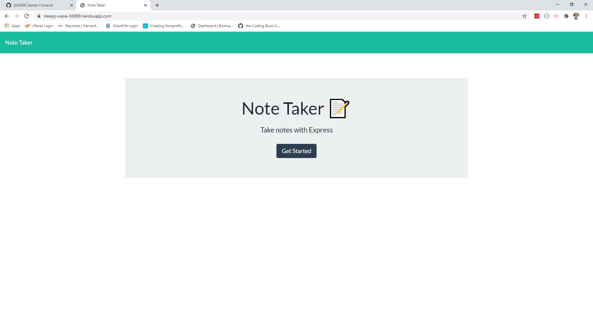

# Note Taker Application 

## Deployed Application

<https://sleepy-wave-36988.herokuapp.com>

## Screenshot

## Description

A simple web-deployed note taking application that uses node.js and the Express web application framework to allow user to write, save, and delete notes to a webpage. The application is structured as follows - 

* Main directory includes a server.js file that sets up a basic http web server using Express.
* server.js sets the "Develop" directory as the static web root
* Develop directory contains "database", "public", and "routes" subdirectories
* "Routes" subdirectory contains two routing files - apiRoutes.js and htmlRoutes.js
* htmlRoutes.js contains the routing logic needed to serve the static webpages from Develop/public (index.html and notes.html)
* apiRoutes.js contains the api routes including the routing logic needed to `POST` and `DELETE` notes in the notes.html webpage
* The `POST` and `DELETE` routes work by adding and deleting notes to / from Develop/db/db.json using a unique id tied to each note object's array position in db.json
* App is deployed via Heroku  

## Table of Contents
* [Installation](#installation)
* [Usage](#usage)
* [Contribution Guidelines](#contribution)
* [Testing](#testing) 
* [License](#license)
* [Questions](#questions)
  
## Installation

No installation needed. Users can visit <https://sleepy-wave-36988.herokuapp.com> to use this communal note-taking app.

## Usage

Users only need to type in a note title and text and can then save the note using the save button in the upper right-hand corner of the webpage. Saved notes can be viewed by clicking on the note box to the left. Notes can be deleted (by anyone) by clicking the delete icon in the note box.

## Contribution Guidelines

All contributions welcome.

## Testing

No testing needed. This is a deployed web application.

## License

MIT

## Questions

* <https://github.com/jth2698>
* <jth2698@gmail.com>